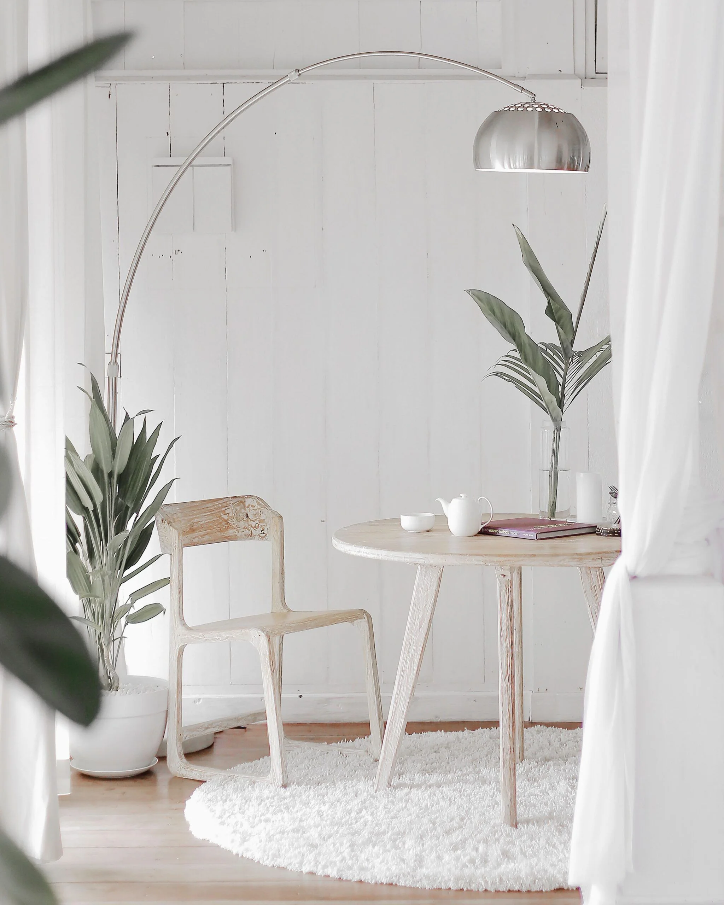
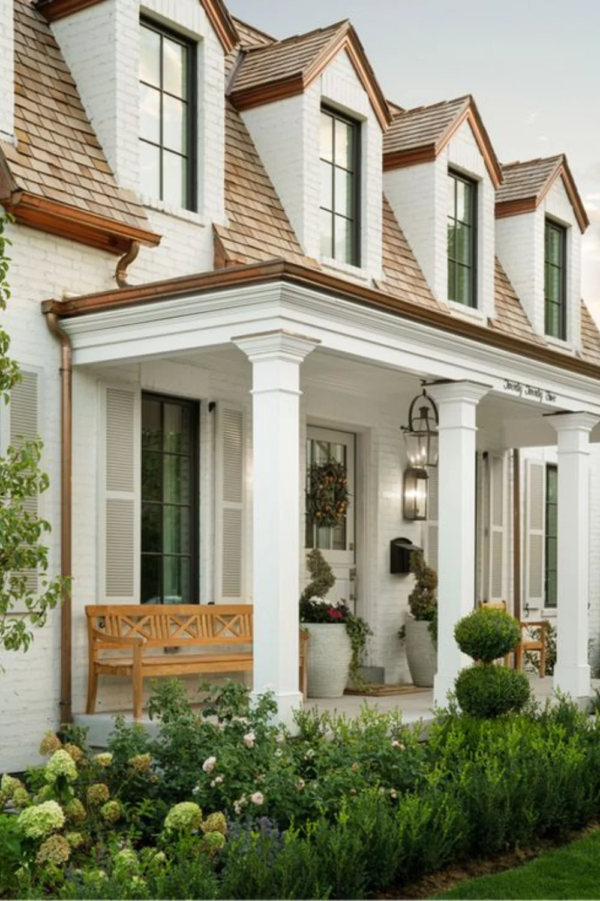
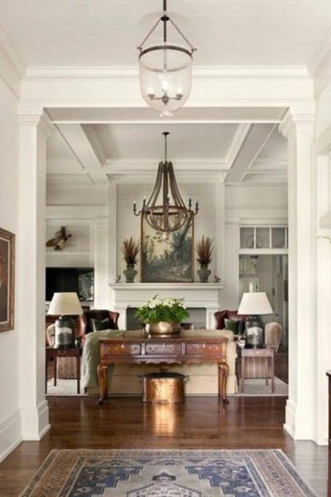
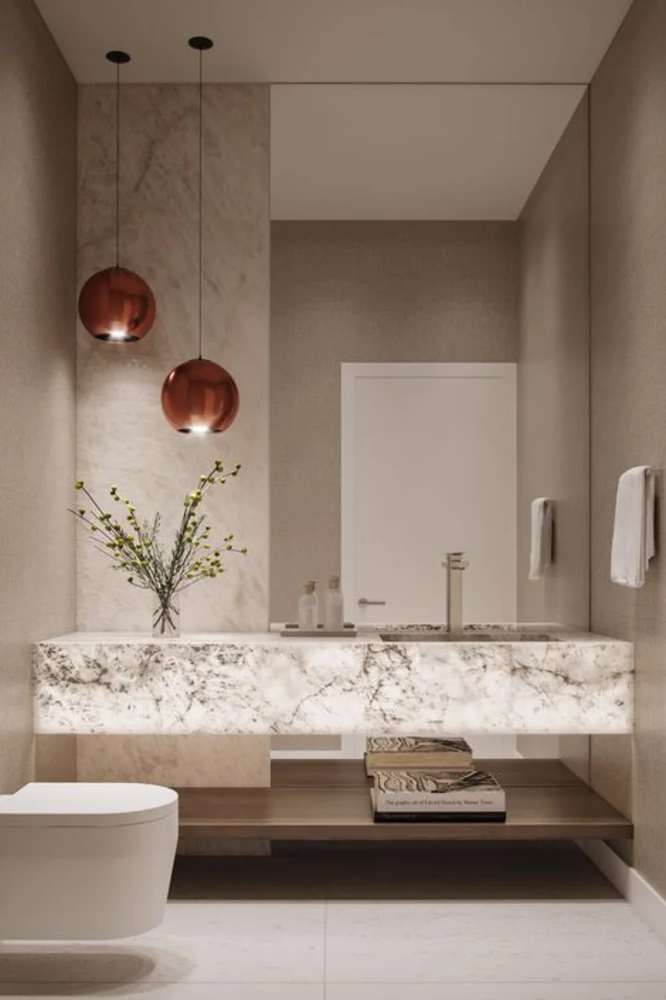
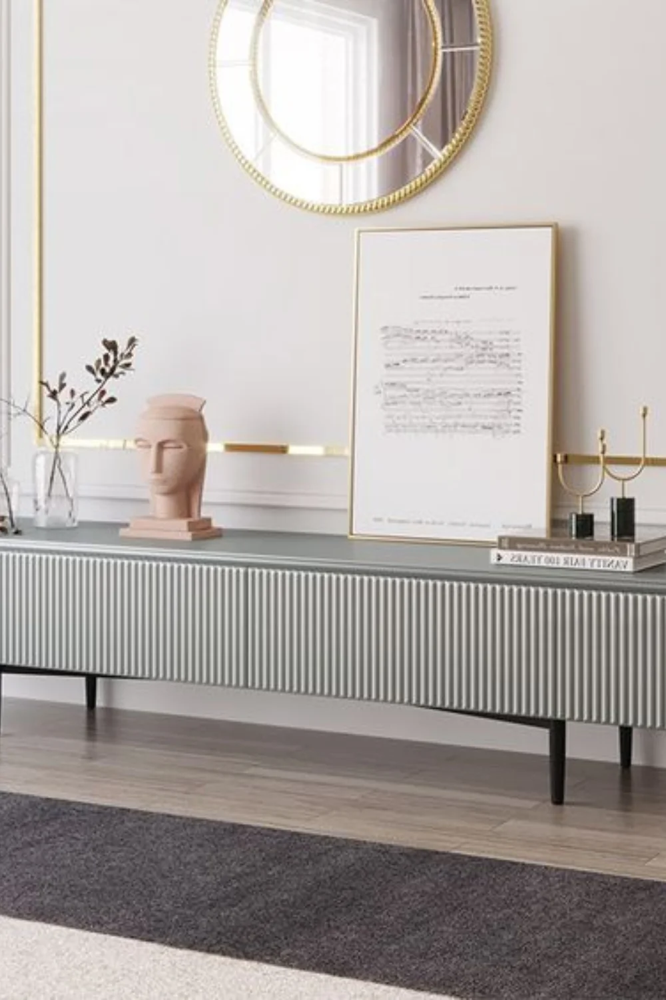
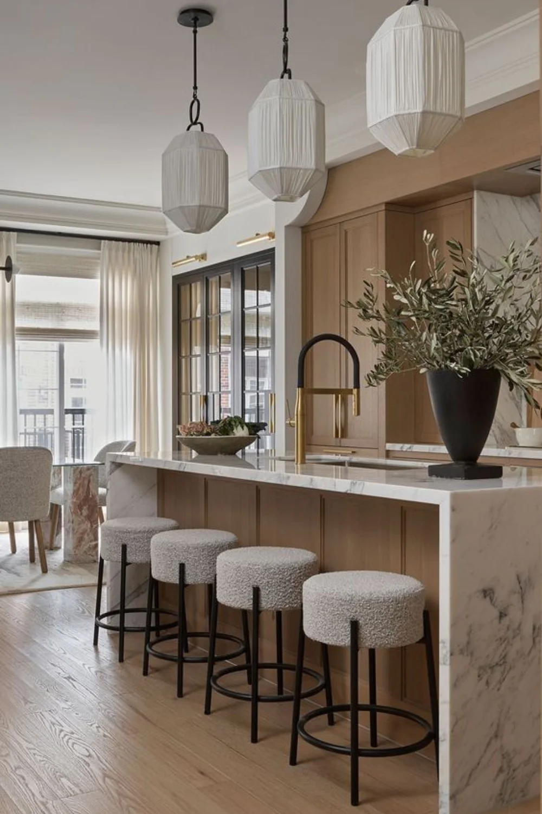
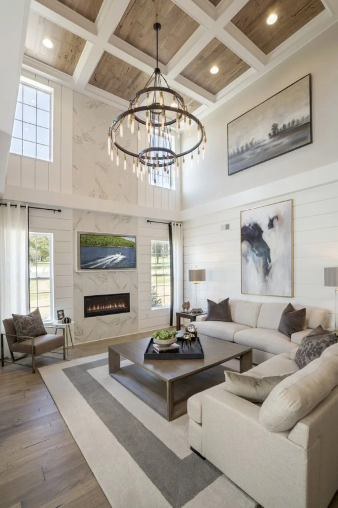
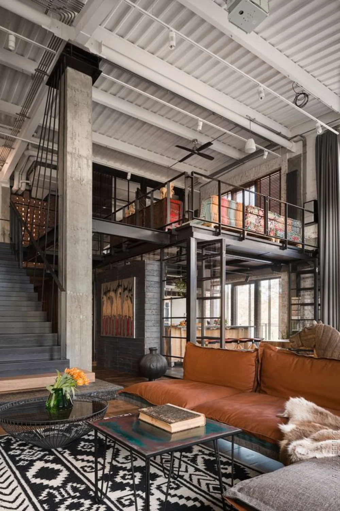
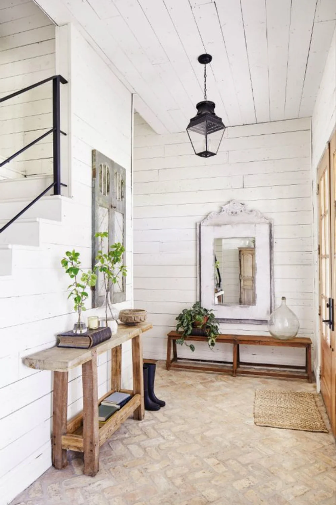

# Finding Your Design Style

**Published:** July 6, 2023  
**URL:** https://parkwayeastdesign.com/finding-your-own-design-style/  
**Category:** Design Guide

---

## Introduction

Discovering your design style is extremely helpful when building a home, redesigning a space, or simply providing direction when working with an interior designer. While rarely does someone fit into a single design style, understanding your tastes and preferences can help guide you through the decision-making process so you can fall in love with your dream space.

Today we're covering a few ways to get inspired and discover your own unique design style.

Before we dive in, don't be worried if your preferences and tastes aren't "in" right now. Trends come and go all the time. While loving what's coming across your Instagram feed is completely okay, design should be a process of self-discovery. We want you to invest in pieces you will treasure in years to come. Learn to trust your instincts.

---

## #1 Reflect on Your Natural Tastes

First, start by reflecting on your own unique tastes. Take a moment to appreciate the parts of your life that uplift and inspire you, without the pressure or influence of the internet. What do you love? How do you like to use your home? Does it serve as a place of gathering and entertainment? Or do you like to keep things cozy and peaceful?

Remember, your home is a reflection of who you are. It becomes a representation of your values and interests.

A simple exercise is to think of feelings or words you would want to describe your home. Do you want it to be cozy, clean, or inviting? How about grand, elegant, or loud? Try identifying the colors, patterns, and materials in your home that you already love. What feelings or words would you use to describe them?

Don't be afraid to take a few cues from your closet either. What else represents your personal style more than your wardrobe? Think of the outfits you're drawn to most. Do you see a lot of patterns and bold colors? Or are they mostly made up of neutrals? If your home was an outfit, what could you never get rid of?

---

## #2 Find Inspiration from Others

Once you have a clear grasp of your preferences, it's time to look elsewhere for some additional inspiration. Go ahead and browse through Pinterest, home-style magazines, or some of the more popular design shows. What jumps out at you? What projects seem to complement your tastes? As you are looking, save the ideas you love.

It's also helpful to consider the places you visit. Whether a distant travel destination or simply a friend's home, pay attention to the unique feeling each space inspires. What have they done to create that feeling?

Looking over your research and what inspires you, you'll start to see some similarities. You might even find a trend begins to emerge—one that's entirely unique to you.

---

## #3 Match it with a Design Style

With your research and inspiration gathered, try matching your style to some of the more common design styles (we've shared a list below with examples to make it even easier). Designers use these to help focus in on a design direction because they are familiar and easy to reference but remember that these are only meant to begin the conversation. You don't have to, and won't likely, identify with any single style. It's perfectly natural to incorporate elements from multiple design concepts into your own.

And your designer should be perfectly willing to work with your tastes. That's what cultivating a home is all about! Together you can refine your vision to something truly unique and personalized to you and your lifestyle—a truly bespoke design.

---

## Design Styles Reference Guide

### Traditional

**Characteristics:** Classic details, elegant, timeless, layers of color and texture.

**Example Designers:**
- Design by The Fox Group
- Design by Melanie Davis Design
- Design by Titus Built

---

### Modern

**Characteristics:** Straight edges, geometric shapes, high-contrast and neutrals.

**Example Designers:**
- Design by Ryan Korban (Photo by Fran Parente)
- Design by Sol Interiors
- Design by Corrigan Studio

---

### Contemporary

**Characteristics:** Soft and simple lines, curved details, natural materials, natural light. Similar to Modern but more feminine with details and layers of texture.

**Example Designers:**
- Design by Mim Design (Build by Vcon, Photo by Peter Clarke)
- Design by Studio McGee
- Photo by Kylemore Living

---

### Transitional

**Characteristics:** Soft details, warm and cozy textures, balance of luxury with comfort. A mix between traditional and contemporary.

**Example Designers:**
- Design by Orsi Panos
- Design by Jean Stoffer (Photo by Stoffer Photography)
- Build & Photo by Toll Brothers

---

### Industrial

**Characteristics:** Raw and rough materials with modern elements. Exposure of concrete, ceiling beams, brick, HVAC, etc.

**Example Designers:**
- Design by Van Os Architecten
- Design by Loft Designe
- Design by Oleg Volosovskyi, Elena Logvynets (Photo by Andrey Avdeenko)

---

### Country & Farmhouse

**Characteristics:** Cozy, clean, rustic, vintage vibes. Soft and neutral colors are common.

**Example Designers:**
- Design by KG Designs
- Design by Nora Murphy (Photo by DuAnne Simon)
- Design by Joanna Gaines

---

### Minimalism

**Characteristics:** Simplicity, clean lines, monochromatic palette, "less is more", natural light.

**Example Designers:**
- Design by Molitli Interieurmakers
- Design by Rachel Valente
- Design by Light and Dwell

---

## Conclusion

We hope you enjoyed finding inspiration you love for your home. If you're still feeling a bit overwhelmed or would like some direction, we recommend working with one of our designers! Their extensive knowledge and experience can provide guidance throughout the design process and help you clarify your own unique style—one you'll love for years to come.

**Ready to get started? Let us help you cultivate your ideal home!**

[Book a Designer Now!](https://parkwayeastdesign.com/inquire/)

---

## Article Images

All images for this article are located in: `images/`

| Filename | Description |
|----------|-------------|
| 6-scaled.webp | Hero/featured image |
| 14-1.webp | Section image |
| 15.webp | Traditional style example |
| 16-1.webp | Traditional style example |
| 17-1.webp | Traditional style example |
| 19.webp | Contemporary style example |
| 20.webp | Contemporary style example |
| 21.webp | Contemporary style example |
| 22.webp | Transitional style example |
| 23.webp | Transitional style example |
| 24.webp | Transitional style example |
| 25.webp | Industrial style example |
| 26.webp | Industrial style example |
| 27.webp | Industrial style example |
| 28.webp | Farmhouse style example |
| 29.webp | Farmhouse style example |
| 30.webp | Farmhouse style example |
| 31.webp | Minimalism style example |
| 33.webp | Minimalism style example |
| 34.webp | Minimalism style example |
| Blog-Post-1000-X-1500-7.webp | Blog post graphic |
| Modern-2.webp | Modern style example |

---

*©2023 Parkway East Design | All Rights Reserved*

