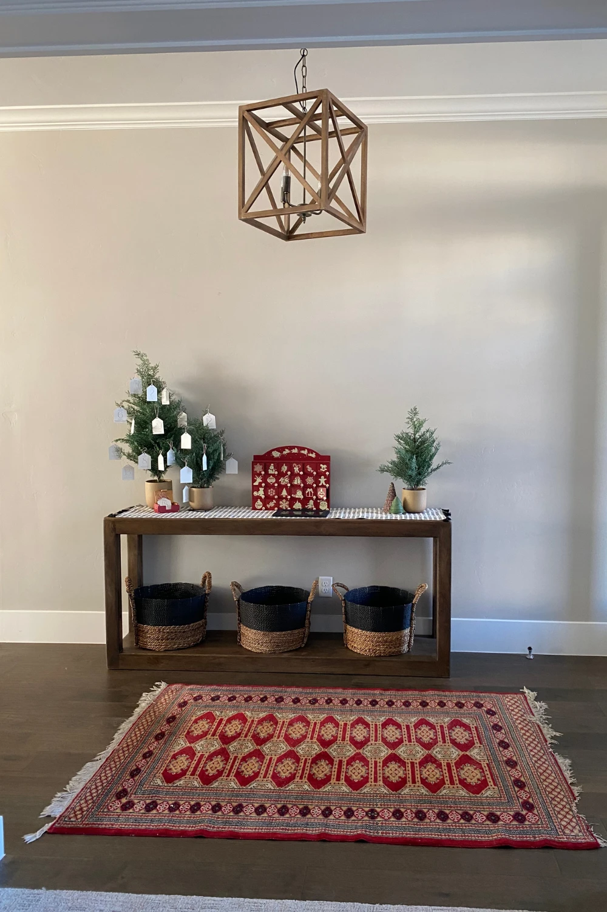
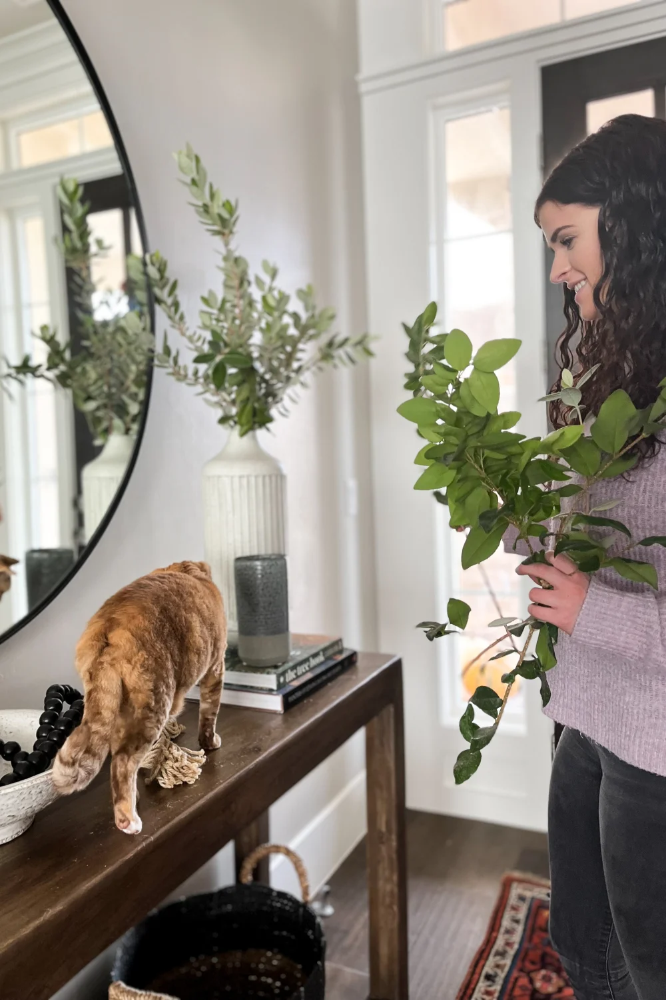
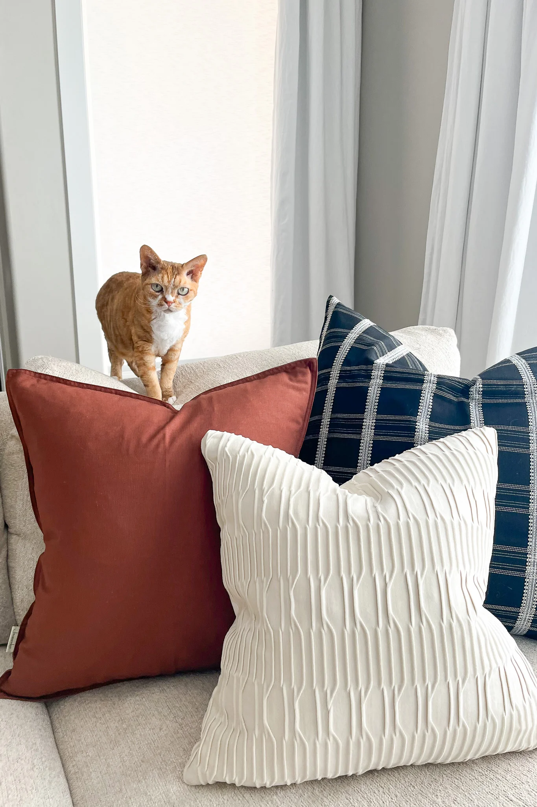
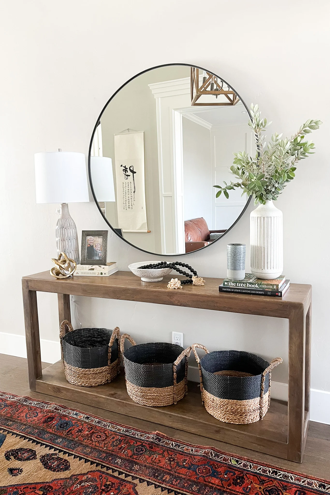

# The Stella Project

**Published:** June 5, 2023  
**URL:** https://parkwayeastdesign.com/the-stella-project/  
**Type:** Residential - Refresh/Update  
**Location:** Southern Utah

---

## Project Overview

After years living in their house, our client was still being asked whether they'd just moved in whenever company came over. Despite her best efforts, she felt like her house didn't quite feel like home. It was still missing something. In truth, it just needed a touch of warmth to set the right tone and turn this entry and living room into a family sanctuary.

Named after their beloved house cat (you'll find her posing throughout this reveal), the Stella Project is a perfect example of how even a small update can refresh and enliven an entire home.

---

## Client Testimonial

> "We've had such a great experience with Eleena and Parkway East Design. She makes the process so easy and FUN! She's one of those people who is 'on it.' I can't recommend them enough."

---

## Entryway Transformation

### Before & After

### Design Approach

As the first introduction into the home, we wanted to create an experience that was both warm and welcoming. We absolutely love how this entryway turned out! It was really just a matter of getting the proportions right to establish the tone within the home.

### Key Design Elements

1. **Round Mirror** - Used this beautiful round mirror to add some much-needed height against the wall and create an illusion of space and variety as it caught the reflection of the rest of the house (details like hanging art and the staircase are doubly appreciated with a well-positioned mirror).

2. **New Rug** - The undersized rug had seen better days, so we swapped it out for a larger one to fill out the room and create a firmer visual foundation.

3. **Simple Accessories** - Brought in some simple accessories to style the console and complete the look.

**Result:** Even with just these few small adjustments, the home already felt more inviting.

---

## Living Room Transformation

### Before & After

### Design Approach

To continue the feeling from the entryway, we incorporated many of the same design elements into the living room. Not only was this the place to host company when they came to visit, but the living room was the ideal spot within the home to gather and relax as a family.

### Key Design Elements

1. **Swivel Chairs** - Sourced swivel chairs with a heavy-duty bouclé fabric to encourage conversation from the adjacent kitchen while allowing visibility of the television for family movie nights.

2. **Drapery** - A bit of drapery helped bring in texture and height, creating visual layers to the wall while providing needed relief from the sun's glare.

3. **Shelf Styling** - Rather than sourcing all new accessories for the shelves, we wanted to use our client's existing pieces to help bring out their own unique personality. Family pictures, art, books, and other heirloom trinkets all carry heartfelt memories. With a little styling and a few new items to add some needed height and dimension, the shelves finally felt balanced and communicated the right spirit throughout the room.

4. **Mid-Century Modern Accents** - Our client was drawn to mid-century modern elements and loved complimenting blues and oranges – which made Stella feel right at home! We incorporated those blues and orange accents with the ottoman, rug, and pillows, providing just the right pop of color to brighten the sofa.

5. **High-Performance Fabrics** - Anticipating her two boys and their pets, we made sure to source high-performance fabrics for better durability under frequent (and sometimes rowdy) use.

6. **Sideboard** - This gorgeous sideboard served two functions, not only for its stylish element but for the purpose of keeping two rambunctious boys from jumping over the sofa. Double win!

7. **Finishing Touches** - A few chunky throws over the seating and accessories arranged throughout the room added to the lived-in feel, and for the finishing touch, we cut sprigs from the yard to provide a complimentary natural element.

### Result

Overall, this living room became a perfect blend of sophistication and cozy family living to suit our client's (and little Stella's) lifestyle.

---

## Project Conclusion

Our client was so thrilled to see the transformation, and we loved being there to share it with them. We can just imagine the many afternoons enjoyed with friends and family and the memories to be made within their home.

We think Stella approves, too.

---

## Project Images

All images located in: `images/`

| Filename | Description |
|----------|-------------|
| Blog-Covers-7.webp | Project cover image |
| 20221107-IMG_0470.webp | Interior detail with Stella |
| Blog-Post-1000-X-1500-3.webp | Entryway before |
| Blog-Post-1000-X-1500-4.webp | Entryway after |
| IMG_0419-2.webp | Living room before |
| IMG_0446-2.webp | Living room after |
| IMG_0450_jpg-2.webp | Living room detail |
| IMG_0460-2.webp | Shelf styling detail |
| IMG_0479_jpg-2.webp | Additional detail |
| Instagram-Landscape-Posts-6.webp | Social media image |

**Total Images:** 10

---

## Design Takeaways

This project demonstrates that:
- Small updates can have a big impact
- Using existing meaningful pieces adds personality
- Proper proportions and styling transform a space
- High-performance fabrics are essential for family living
- A well-placed mirror can double the visual appeal

---

**Ready to get started? Let us help you cultivate your ideal home!**

[Book a Designer Now!](https://parkwayeastdesign.com/inquire/)

---

*©2023 Parkway East Design | All Rights Reserved*

